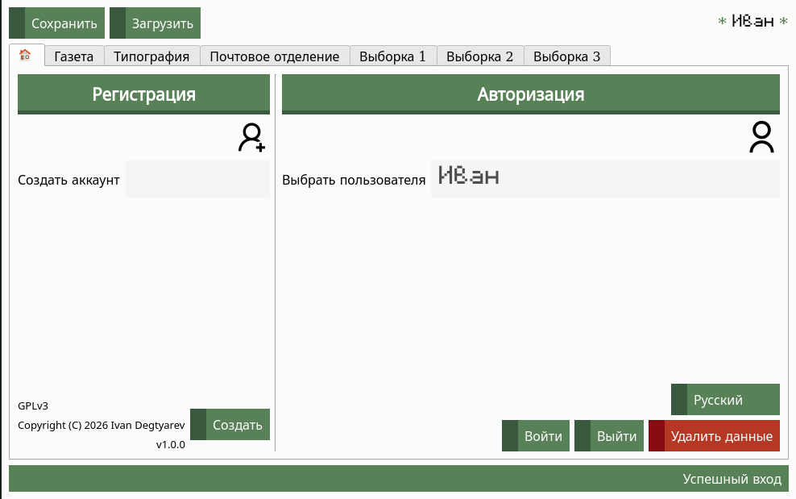
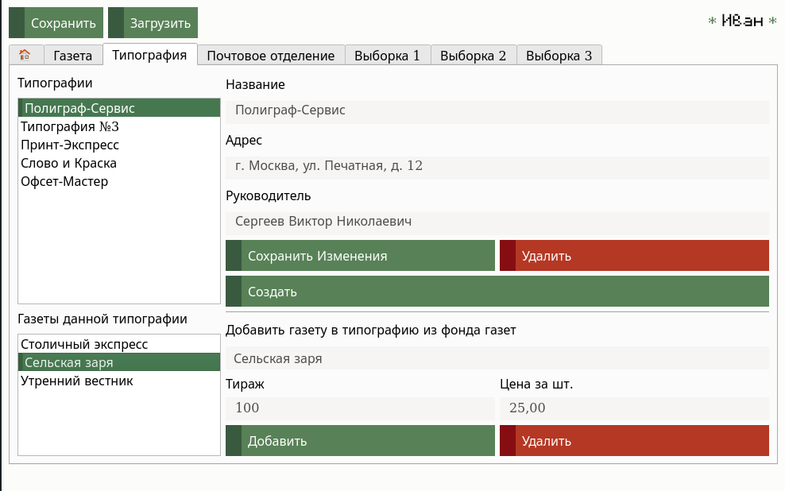
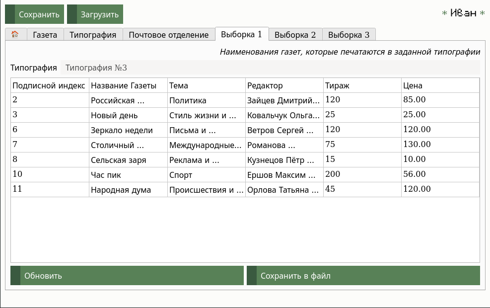

# GazetLogistics

**Система учёта распространения печатной продукции (газет) между типографиями и почтовыми отделениями**

[](https://www.gnu.org/licenses/gpl-3.0)
[](https://www.qt.io)
[](https://isocpp.org/)

---

## 📋 Описание

**GazetLogistics** — это оконное приложение на C++ с графическим интерфейсом на Qt, предназначенное для автоматизации учёта и контроля распространения газет в городской инфраструктуре. Программа позволяет вести справочники газет, типографий и почтовых отделений, связывать их между собой (какие газеты и каким тиражом печатаются в типографии, какие и в каком количестве поступают в почтовые отделения), а также выполнять типовые аналитические запросы с возможностью экспорта в CSV.

---

## 🚀 Основные возможности

- **Многопользовательский режим** — каждый пользователь работает со своим набором данных (логин, пароль отсутствует, только имя учётной записи).
- **Справочники**:
  - **Газеты** — название, тематика (15 категорий), уникальный подписной индекс, редактор.
  - **Типографии** — название, адрес, директор. Для каждой типографии можно указать список печатаемых газет с тиражом и ценой за экземпляр.
  - **Почтовые отделения** — номер, адрес, обслуживаемый район. Для каждого отделения можно сформировать заказ на поставку газет из выбранных типографий с указанием количества и продажной цены.
- **Три информационных запроса** (с сохранением результатов в CSV):
  1. Перечень газет, печатаемых в выбранной типографии (с тиражом и ценой).
  2. Список типографий, выпускающих заданную газету (с тиражом и ценой).
  3. Расчёт общей стоимости тиража выбранной газеты по всем типографиям.
- **Хранение данных** — в формате XML (отдельные файлы для газет, типографий и почтовых отделений внутри каталога пользователя).
- **Интернационализация** — поддержка русского, английского и японского языков с сохранением выбора.
- **Каскадное удаление** — при удалении газеты или типографии автоматически удаляются связанные заказы в почтовых отделениях и привязки в типографиях.

---

## 🖥️ Технологии

- **Язык**: C++17
- **Фреймворк**: Qt 6 (Widgets, Core, GUI, Linguist)
- **Парсинг XML**: tinyxml2
- **Сборка**: ручная компиляция через qmake / CMake (проект предоставлен с исходниками)
- **Лицензия**: GNU GPLv3

---

## 📦 Установка и сборка

### Требования

- Операционная система Linux (тестировалась на Ubuntu 20.04+), Windows или macOS (теоретически, но не проверялась)
- Qt 6 (Core, Widgets, Linguist)
- Компилятор с поддержкой C++17 (g++ 9+, clang 10+)
- CMake (>= 3.16) или qmake

### Сборка из исходников

```bash
# Клонирование репозитория
git clone https://github.com/yourusername/GazetLogistics.git
cd GazetLogistics

# Создание директории для сборки
mkdir build && cd build

# Конфигурация (CMake)
cmake .. -DCMAKE_PREFIX_PATH=/path/to/Qt6

# Компиляция
make -j$(nproc)

# Запуск
./GazetLogistics
```

## 🎮 Использование

### Авторизация

- На вкладке «Home» выберите существующего пользователя из списка или создайте нового (логин не должен содержать символы `\/:*?"<>|!`).
- Нажмите **Login** — после этого станут доступны все остальные вкладки.

### Работа с газетами (вкладка «Newspaper»)

- Добавляйте, редактируйте, удаляйте газеты. Подписной индекс назначается автоматически.

### Работа с типографиями (вкладка «Printing house»)

- Добавляйте типографии, указывайте для них печатаемые газеты (тираж, цена).

### Работа с почтовыми отделениями (вкладка «Post office»)

- Добавляйте отделения, формируйте заказы на поставку газет из выбранных типографий (количество, продажная цена).

### Сохранение / загрузка

- После внесения изменений нажмите **Save** — данные сохранятся в XML-файлы текущего пользователя.
- **Load** — перезагружает последнее сохранённое состояние.

### Запросы (вкладки «Selection 1», «Selection 2», «Selection 3»)

- Выберите нужную типографию / газету, нажмите **Update**.
- Результат отображается в таблице.
- **Save to a file** — экспортирует таблицу в CSV-файл в рабочую директорию (`select1.csv`, `select2.csv`, `select3.csv`).

### Смена языка

- Кнопка «English/Русский/日本語» на вкладке Home.

---

## 📁 Структура проекта
```text
GazetLogistics
│
├── 📁 screenshots # Скриншоты интерфейса для документации
├── 📁 resurses # Ресурсы приложения
│ ├── 📁 languages # Файлы переводов (.qm: rus, eng, jpn)
│ └── 📁 svg # Иконки (user.svg, user-add.svg)
├── 📁 data # Пользовательские данные (создаётся автоматически)
│ └── 📁 <username> # Каталог для каждого пользователя
│ ├── 📄 newspapers.xml # Газеты
│ ├── 📄 printing_house.xml # Типографии
│ └── 📄 post_office.xml # Почтовые отделения
├── 📁 libs # Внешние библиотеки (например, tinyxml2)
├── 📁 so # (возможно, shared objects или объектные файлы)
├── 📄 form.h # Заголовочный файл с UI-классом (сгенерирован из form.ui)
├── 📄 form.ui # Файл описания интерфейса (Qt Designer)
├── 📄 main.cpp # Главный исходный файл (точка входа, классы Newspaper, PrintingHouse, PostOffice, BD, Main)
├── 📄 Makefile # Файл сборки (make)
├── 📄 .gitignore # Исключения для Git
└── 📄 LICENSE # Лицензия GNU GPLv3
```
---

## 🤝 Благодарности

- Фреймворк [Qt](https://www.qt.io) за мощный инструментарий для кроссплатформенной разработки.
- Библиотека [tinyxml2](https://github.com/leethomason/tinyxml2) для удобной работы с XML.
- Всем преподавателям кафедры ПО ВТ и АС Оренбургского государственного университета.

---

## ✍️ Автор

**Дегтярев Иван Евгеньевич**  
Студент группы 25ПИнж(б)-2  
Оренбургский государственный университет им. В. А. Бондаренко  
Курсовая работа по дисциплине «Программирование и алгоритмизация»

---

## 📸 Скриншоты

*Ниже приведены примеры интерфейса.*

| Главное окно | Работа с типографиями | Запрос 1 |
|--------------|-------------------|----------|
|    |        |  |


---

## 🐛 Сообщения об ошибках и предложения

Если вы нашли ошибку или хотите предложить улучшение, создайте **Issue**.
